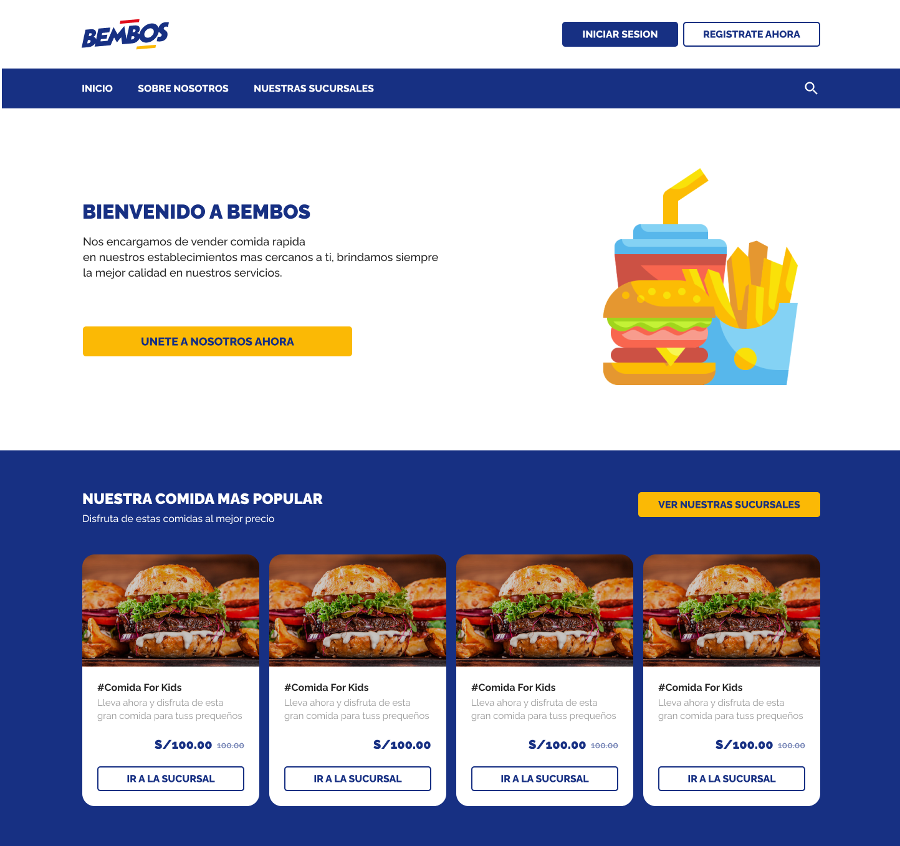

# 🍔 Food-Proyect - v2

Aplicacion para dar a conocer distintas sucursales de una misma marca de comida.

<div style="padding-bottom: 2em;">
  <div style="padding: .5em 0;">
    
  </div>
  <a href="https://www.figma.com/file/D3bNmXHbscYuEpMtNsOaWE/Ventas-Online?node-id=118%3A0"><em>Ver diseño en figma</em></a>
</div>

# 💻 Tecnologías

- [React JS](https://es.reactjs.org/) - Libreria JS
- [Styled Components](https://styled-components.com/) - Css in Js
- [Typescript](https://styled-components.com/) - Transpiladorr de JS
- [Jotai / Context](https://github.com/pmndrs/jotai) - State Management
- [Lerna](https://github.com/lerna/lerna) - Manejador de multiples proyectos (Monorepo)

<br>

# ⚠ Requisitos

- Yarn / Npm (v7 > x.x)

<br>

# 🔨 Instalacion

Posicionese en la raiz del proyecto y desde la consola digite el siguiente comando

```ssh
yarn install
```

<br>

# 🔑 Scripts

Comandos para levantar cada una de las aplicaciones en local

```ssh
yarn start:website
yarn start:admin
```

Comandos para crear el bundle de cada aplicación

```ssh
yarn build:website
yarn build:admin
```

<br>

# 👦 Desarrolladores

<div style="display:grid; grid-template-columns:repeat(2,max-content);column-gap:2em">
<div style="display:grid;row-gap:5px">

<a href="https://github.com/josedaesbar">BiloCode</a>
</div>

<div style="display:grid;row-gap:5px;justify-items:center">

<a href="https://github.com/josedaesbar">josedaesbar</a>
</div>
</div>
